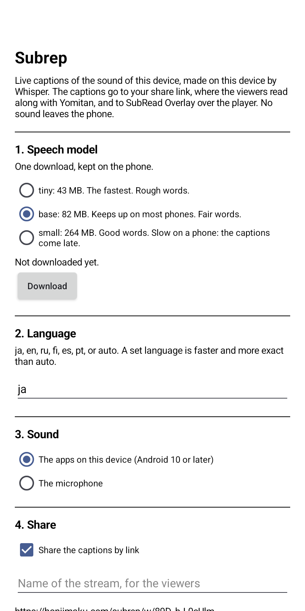

# Subrep for Android

[Subrep](https://honjimaku.com/subrep/) on a phone: live captions of the
sound of the device, made on the device by Whisper, shared by link. The
captions on the phone are free. Cloud captions, from a larger model, cost
hours that you buy on subread.space.

The app captures the sound of the apps on the phone (a video, a game, a
browser) or the microphone. Whisper, on the phone, turns it into captions.
The captions go to your share link on `honjimaku.com`, where the viewers read
along and mine with Yomitan, and to
[SubRead Overlay](https://github.com/equwal/subread-overlay) over the player,
where a tap on a word opens the dictionary. With captions on the phone, no
sound leaves the phone.

## Screenshots

<p>
  
</p>

The picture is from a Viwoods AiPaper Reader.

## How to use it

1. Choose where the captions are made: on this phone (free), or in the
   cloud. For the cloud, buy hours with a button under the choice, then come
   back to the app. The cloud needs no model: go to step 3.
2. Choose the speech model and press "Download". `base` (82 MB) keeps up on
   most phones. `small` (264 MB) reads better and comes late. `tiny` is for
   an old phone.
3. Enter the language: `ja`, `en`, `ru`, ... or `auto`. A set language is
   faster and more exact.
4. Choose the sound: the apps on this device (Android 10 or later), or the
   microphone.
5. Press "Start the captions". Android asks for the capture of the screen
   ("Share entire screen"), and once for the microphone permission. That
   permission covers the sound of the apps too.
6. Start the video. The captions come to the app, to the link and to the
   overlay. The notification has a "Stop" button.

The share link stays the same across restarts. "New link" makes another one,
and the old one stops.

## Cloud captions

The cloud uses Whisper large-v3 turbo on DeepInfra, through subread.space. It is
more exact than the models that a phone can run, and it uses less battery.

| Pack | Price |
|---|---|
| 20 hours | $4.99 |
| 80 hours | $16.99 |
| 200 hours | $39.00 |

Each piece of speech costs its length, rounded up to the next second.
Silence costs nothing: the app sends only speech. The hours do not expire.

The hours belong to the account of this app on subread.space. The screen
shows its id (`acct_...`). If you install the app again, the app gets a new
account: write to the contact address on subread.space with the old id and
the receipt, and we move the hours.

What goes where: each piece of speech goes to subread.space, which gives it
to DeepInfra for the text. subread.space keeps neither the sound nor the
text. DeepInfra says that it does not store them ([data privacy](https://docs.deepinfra.com/account/data-privacy)).
The app sends nothing while the phone makes the captions.

## What the phone cannot capture

- An app that refuses the capture of its sound: a video app with DRM, and
  some music apps. Android gives silence. Use the microphone.
- Sound from another device over Bluetooth. A phone is a Bluetooth source,
  not a speaker.

## How it works

`CaptureService` reads 16 kHz mono PCM from `AudioRecord` (with an
`AudioPlaybackCaptureConfiguration` for the apps, or the microphone).
`Segmenter` cuts it into pieces at pauses, with the rules of the desktop
app: a block of 32 ms is speech above the noise floor times 3, a pause of
0.65 s closes a piece, 11 s is the most. `Engine` gives each piece to a
`Recognizer` on one thread: whisper.cpp (`Whisper`), or the cloud
(`CloudRecognizer`, which posts 16-bit PCM to
`https://subread.space/api/captions/transcribe`). Whisper runs with the encoder window cut to the length of the
piece, and drops the invented lines that `Hallucinations` lists. Each piece
is one final caption.

The relay protocol is that of `subrep.share`: a websocket to
`wss://honjimaku.com/subrep/pub/<room>`, a hello with the room secret, then
`{"type":"final","text":...,"tr":"","ts":...}` for each caption.

The overlay protocol is the `line` method of the content provider
`content://space.subread.overlay.player`.

`adb shell dumpsys activity service com.honjimaku.subrep/.CaptureService`
prints the state, for a bug report.

## Build

whisper.cpp is a submodule:

```
git submodule update --init
./gradlew :app:testDebugUnitTest :app:assembleDebug
```

The native library is built for 64-bit ARM with ARMv8.2 half-precision and
dot-product instructions (each phone since 2018). NDK 29 and CMake 3.31.6
from the Android SDK.

For a release, set `SUBREP_KEYSTORE_FILE`, `SUBREP_KEYSTORE_PASSWORD` and
`SUBREP_KEY_ALIAS` (default `subrep`), then `./gradlew :app:assembleRelease`.

## Licence

AGPL-3.0. whisper.cpp is MIT.
